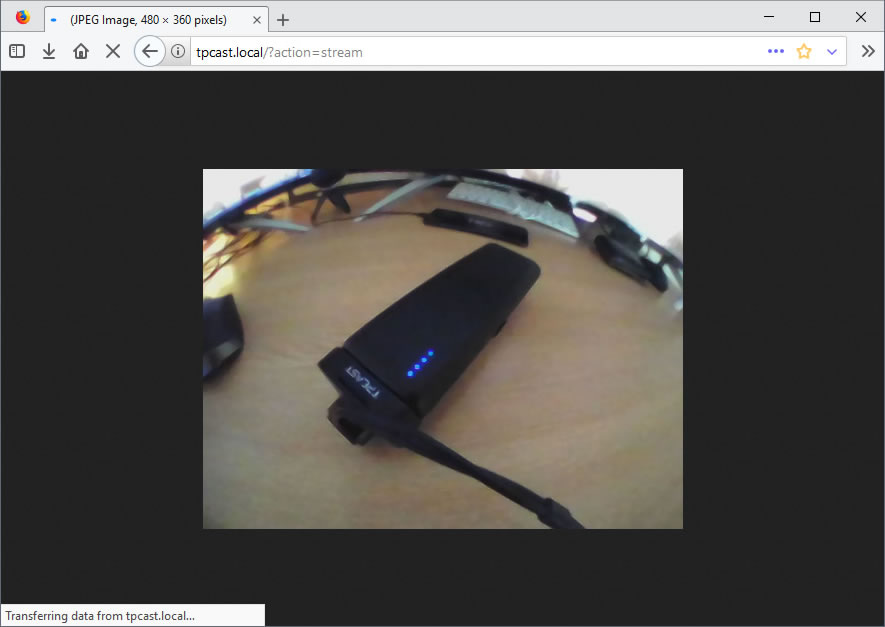

# Streaming the HTC Vive Camera (Experimental!)

## Overview
This process will install mjpg-streamer on a TPCast power box that has already been upgraded with an OpenTPCast image to automatically stream the HTC Vive on-board camera over HTTP, which can then be displayed in VR using third party VR overlay software (e.g. [OVRDrop](http://store.steampowered.com/app/586210/OVRdrop/)).

**This functionality should be considerered experimental and should not be attempted unless you know what you are doing.**

It is planned to streamline this solution to enable it to be included in official OpenTPCast images by default with minimal configuration required on the end user's side.

## Disclaimer
**This upgrade is performed at your own risk! OpenTPCast and its contributers will not be held responsible for any physical damage, data loss or voided manufacturer warranties incurred due to modification or tampering of your TPCast hardware or software.**

## Preparation
- Download and install [Putty SSH client](http://www.putty.org/) on your local machine, which will be used to connect to your TPCast power box.
- Ensure that the TPCast power box is connected to an internet-enabled router, either over Wi-Fi, or using a USB to ethernet adapter.

## Installation
1. Power up the TPCast power box by plugging in the battery and wait a few minutes, then launch Putty and connect with the following details:
	- Hostname: tpcast.local (or locate the IP address of the TPCast power box by checking your router's connected client list - e.g. 192.168.XXX.XXX)
	- Port: 22
	- Username: pi
	- Password: 1qaz2wsx3edc4rfv
1. In the Putty terminal, run the following command to install the camera streaming service:
```bash
sudo wget -e check_certificate=off https://rawgit.com/OpenTPCast/Docs/master/files/camerastream/opentpcast-camerastream && sudo chmod +x ./opentpcast-camerastream && sudo ./opentpcast-camerastream
```

## Accessing The Camera Stream


Navigate to http://tpcast.local/?action=stream to view the HTC Vive camera stream.  This stream can then be displayed in VR using third party overlay software (e.g. [OVRDrop](http://store.steampowered.com/app/586210/OVRdrop/)).

## Enabling/Disabling The Camera Stream
To disable the camera streaming service, run the following command in the Putty terminal, then reboot the TPCast power box:
```bash
sudo update-rc.d -f vivecamstream remove
```

To reenable the camera service, run the following command in the Putty terminal, then reboot the TPCast power box:
```bash
sudo update-rc.d vivecamstream defaults
```
