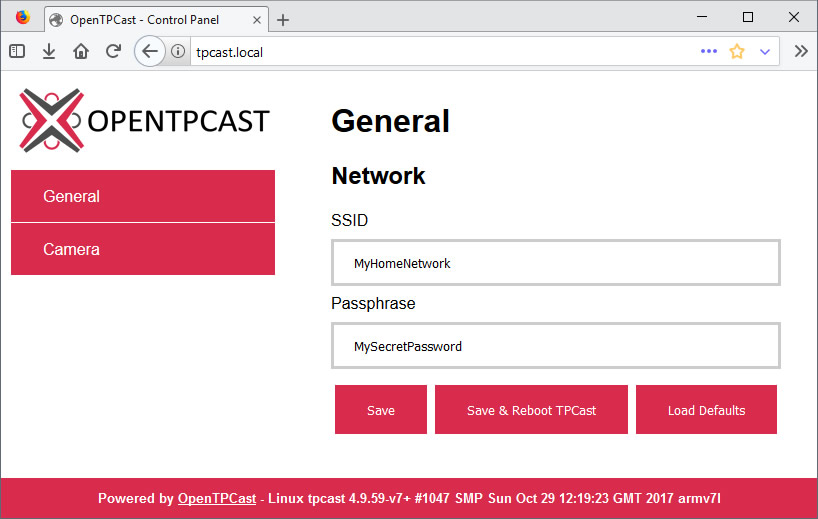

# Optimizing The TPCast Router

## Table Of Contents
* [Connecting To The TPCast Router](#connecting-to-the-tpcast-router)
* [Switching To Another Wi-Fi Network Mode](#switching-to-another-wi-fi-network-mode)
* [Switching To Another Wi-Fi Channel](#switching-to-another-wi-fi-channel)
* [Using A Different Router](#using-a-different-router)
* [Customizing Wi-Fi Credentials](#customizing-wi-fi-credentials)
  * [Updating The TPCast Router Credentials](#updating-the-tpcast-router-credentials)
  * [Updating The TPCast Power Box Credentials](#updating-the-tpcast-power-box-credentials)

## Connecting To The TPCast Router
The TPCast router control panel can be accessed from http://192.168.144.1 (CE) or http://192.168.1.1 (PRE) using a web browser and the following credentials:
- Username: tproot (if prompted)
- Password: 8427531 (CE) or 12345678 (PRE)

## Switching To Another Wi-Fi Network Mode
If you experience regular tracking issues, it may be nessecary to update the stock TPCast router to operate in "11a only" network mode.
1. In the router control panel, navigate to `WLAN Settings` > `Basic Settings` > `5G` and change `Network Mode` from `11vht AC/AN/A` to `11a only`.
1. Click `Save` to apply the changes.

## Switching To Another Wi-Fi Channel
If you continue to experience tracking issues, you may have to select a different channel.  The channel you select will vary based on region, outside interference and network configuration so try each channel until one works well for your setup.
1. In the router control panel, navigate to `WLAN Settings` > `Basic Settings` > `5G`, and change `Channel` from `AutoSelect` to a different option.
1. Click `Save` to apply the changes.

## Using A Different Router
Alternatively, using a more reliable router to overcome poor connection or bandwidth issues exhibited by the stock TPCast router may be an option.  The following routers have been tested by community members with the OpenTPCast upgrade and have shown to work as suitable replacements to the TPCast router:
- Asus RT-AC68U
- D-Link AC1750
- Linksys WRT1900ACS
- Netgear WNDR3700
- Ubiquiti UAP-AC-HD

## Customizing Wi-Fi Credentials
Devices upgraded to OpenTPCast can be configured to use custom Wi-Fi credentials for additional security, or to connect the TPCast to a different router.

### Updating The TPCast Router Credentials
1. In the router control panel, navigate to `WLAN Settings` > `Security Settings` > `5G` and change the `SSID` and `Password` fields to the desired credentials.
1. Click `Save` to apply the changes.

### Updating The TPCast Power Box Credentials

**Method 1: OpenTPCast Control Panel**

1. Navigate to http://tpcast.local (or `http://<tpcast-ip-address>` if not using Bonjour) in your web browser.
1. Navigate to `General` > `Network`, and amend `SSID` and `Passphrase` with the desired credentials.
1. Click `Save & Reboot` to apply the changes.

**Method 2: Configuration File**
1. [Remove the MicroSD card](https://github.com/OpenTPCast/Docs/blob/master/guides/SDCARD.md#accessing-the-microsd-card) from your TPCast power box, insert the MicroSD card into your computer and locate the boot partition in My Computer/This PC.
1. In the boot drive, edit the file `opentpcast.txt` in [Notepad++](https://notepad-plus-plus.org/) (or another text editor that handles Unix line endings), amend `ssid` and `passphrase` with the desired credentials, then save the file.
```
ssid=MyHomeNetwork
passphrase=MySecretPassword
```
1. Create an empty file in the boot partition called `initwlan` if the file does not exist, [ensuring that there is no file extension](https://support.microsoft.com/en-gb/help/865219/how-to-show-or-hide-file-name-extensions-in-windows-explorer).
1. Remove the MicroSD card from the computer and insert the MicroSD back into the TPCast power box.
